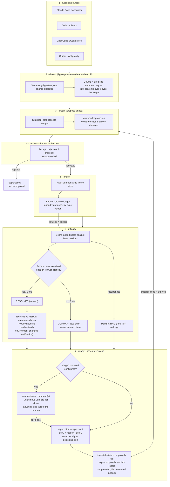

# Gotcontext Memory

A memory system for AI coding agents. It stores what an agent should remember as
plain markdown files on disk, and it learns by reading session history: a `dream`
pass scans the transcripts of every supported CLI agent on the machine, finds
patterns that recur across sessions, and turns them into proposals. Nothing is
written to memory until a human accepts it.

It reads the histories of Claude Code, Codex, Cursor, OpenCode, and Antigravity
through a single classifier, so a pattern that shows up in more than one tool is
counted once, with one prevalence figure. After a note is accepted, the
`efficacy` command checks whether the problem it describes actually stopped
recurring, per model, and recommends retiring notes that worked and hardening
ones that did not. Zero recurrences is only called `RESOLVED` when the failure
class was exercised enough to trust the silence — a thin post-acceptance window
scores `DORMANT` instead, never a stealth win. Retiring a note that is only
"working" because it is loaded every session requires an explicit
mechanized/environment-changed justification (cure vs treatment); without one,
`efficacy` recommends `RETAIN`. A `report` command turns expiry candidates and
notes needing attention into a self-contained `report.html` a human can decide
on and `ingest-decisions` applies.

## Getting started

- [docs/START-HERE.md](docs/START-HERE.md) — orientation, no prior context assumed
- [docs/guides/quickstart.md](docs/guides/quickstart.md) — install, init, first dream
- [docs/README.md](docs/README.md) — full documentation map
- [docs/guides/rebuild-from-scratch.md](docs/guides/rebuild-from-scratch.md) — rebuild the system from its docs alone
- [CONTRIBUTING.md](CONTRIBUTING.md) — contributions, plus [bug reports and feature requests](https://github.com/oimiragieo/gotcontext-memory/issues/new/choose)

## Install

```bash
cd gotcontext-memory
npm install
npm run build
npm link   # exposes `gotcontext-memory` (and an optional `gcm` alias)
```

Use the `gotcontext-memory` binary. The shorter `gcm` alias can collide with Git
Credential Manager on Windows.

```bash
gotcontext-memory init          # creates ~/.gotcontext
gotcontext-memory init --project
gotcontext-memory dream --source claude --store user --force
gotcontext-memory review list
gotcontext-memory efficacy --source all
gotcontext-memory report --out report.html   # open it, decide, save decisions.json
gotcontext-memory ingest-decisions decisions.json
gotcontext-memory usage --skills-dir ~/.claude/skills
gotcontext-memory doctor
gotcontext-memory export --out /abs/path/out.gcm.gz
gotcontext-memory mcp   # thin JSON-RPC memory tools
```

The full command reference is in [docs/reference/cli.md](docs/reference/cli.md).

## How a memory evolves, end to end

Every stage below is a command you run (or schedule); the two feedback edges at
the bottom are the point of the design — decisions and outcomes flow back into
the next dream, so the system learns from its own track record, not just from
new transcripts.



Two properties worth noticing. First, a refused or rejected write can never be
scored as a success: efficacy reads the import-outcome ledger, so only notes
that verifiably landed are ever judged. Second, silence is not victory: a note
whose failure class went quiet scores `DORMANT`, not `RESOLVED`, and a note
that is working *because it is loaded every session* is recommended `RETAIN`
until the rule is mechanized or the environment changed — retiring the
treatment is not the same as curing the disease.

To verify the install against each supported harness in containers (Windows
PowerShell with Docker Desktop):

```powershell
pwsh -File scripts/docker-verify.ps1              # full matrix
pwsh -File scripts/docker-verify.ps1 -Harness codex
# or: npm run verify:docker
```

Details: [docs/guides/docker-verification.md](docs/guides/docker-verification.md).

## Supported harnesses

| Harness | Instruction install | Session history |
|---|---|---|
| Claude Code | yes | Full, from JSONL transcripts, including skill invocations where present |
| Codex | yes | Full turns, parsed from the native rollout format; injected developer/system turns are excluded |
| Cursor | yes | JSONL and `.vscdb` SQLite session stores |
| OpenCode | yes | Read directly from the OpenCode SQLite database, newest sessions first |
| Antigravity (agy) | yes | Partial: candidate files are enumerated, but no parser has been validated against a real corpus yet |

All five feed the same classifier, so sessions are scored by identical rules
regardless of which tool produced them. Details and file formats:
[docs/adapters/harness-matrix.md](docs/adapters/harness-matrix.md).

## Scope and claims

[docs/HONESTY.md](docs/HONESTY.md) is the authoritative statement of what this
package does and does not do. The short version: the pipeline is transcript to
proposal to human accept. Nothing modifies canonical memory automatically — not
the dream, not the efficacy loop, not the MCP server in its default
configuration. The version stays 0.9.0 until the release criteria in HONESTY.md
are met.

## Architecture notes

- All writes inside the store root go through `MemoryStore`
  (`commitCanonical`, `commitOperational`, `deleteCanonical`). The installer
  touches external harness instruction files only.
- Concurrency safety is compare-and-swap on sha256 hashes; the memory index
  (`MEMORY.md`) is capped at roughly 200 lines / 25 KB and regenerated under
  lock, never truncated silently.
- Transcript ingestion is streamed with bounded memory; corpus size does not
  limit whether a dream can run. Ingestion failures are reason-coded
  (`truncated` is not `malformed`).
- The MCP server is a thin JSON-RPC layer over the same store, additive only.

Deep dives: [docs/architecture/overview.md](docs/architecture/overview.md) and
[docs/features/memory-store.md](docs/features/memory-store.md). Design history,
including plans and audits, is preserved in [docs/superpowers/](docs/superpowers/).

## For coding agents working in this repository

- [AGENTS.md](AGENTS.md) — entry rules, verification commands, working-tree hygiene
- [CLAUDE.md](CLAUDE.md) — the same contract, for Claude Code
- [docs/SKILLS.md](docs/SKILLS.md) — skill registry
- [docs/WORKFLOWS.md](docs/WORKFLOWS.md) — documentation and skill maintenance workflows
- [docs/LESSONS_2026-08-09.md](docs/LESSONS_2026-08-09.md) — load-bearing lessons (L1–L24)
- [docs/features/efficacy.md](docs/features/efficacy.md) — post-acceptance scoring
