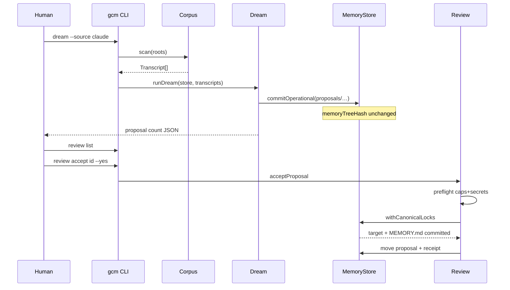

# HITL dreaming — the product loop

**Code:** `src/dream/run.ts`, `src/review.ts`, `src/corpus/*`  
**Related:** [dream feature](../features/dream.md) · [review feature](../features/review.md) · [HONESTY](../HONESTY.md)

---

## Definition

**Dreaming** in this package means:

> Scan transcripts → extract candidate memory changes → write **proposals** →
> wait for a human to accept or reject.

It does **not** mean automatic fact reconciliation or silent apply
(omega `memory_dream` parity is explicitly out of scope).

---

## Stages

### Stage A — Corpus

Importers turn on-disk session logs into `Transcript` objects:

| Source | Status |
|---|---|
| Claude Code | Full JSONL importer |
| Codex | Full JSONL importer (turns) |
| Cursor | JSONL + read-only `node:sqlite` `.vscdb` |
| agy / OpenCode | PARTIAL — enumerate only |

Details: [corpus-importers.md](../features/corpus-importers.md),
[transcript-formats.md](../adapters/transcript-formats.md).

### Stage B — Policy filter

`applyDreamPolicy` (`src/dream/policy.ts`):

- Drop transcripts whose `source` is in `dream.policy.excludeSources`
- If `dream.policy.focus` is set, keep only transcripts whose turn text contains
  at least one focus keyword (case-insensitive)

Empty kept set → `EMPTY_CORPUS` error (nonzero exit). Zero is labeled, never a
silent “clean” success.

### Stage C — Extract proposals

`extractProposals` looks for user/human turns matching preference-like phrases
(`please remember`, `always`, `prefer`, `from now on`). It builds `create`
proposals with deterministic ids (`proposalId` = sha256 of stable fields).

Additionally, `staleExpireProposals` may emit `expire` actions for memory files
older than ~90 days (based on frontmatter timestamps).

### Stage D — Write proposals (operational)

For each candidate:

1. Secret-scan body + evidence quotes
2. If clean → `commitOperational(proposals/<id>.json)`
3. If secret → increment `withheldSecrets`, skip

Assert `memoryTreeHash` unchanged. Return `{ proposals, withheldSecrets, dropped }`.

`maxProposals` truncates after extraction; dropped count includes those truncations.

### Stage E — Human review

| Command | Effect on canonical memory |
|---|---|
| `review list` / `show` | none |
| `review reject` | none (`memoryTreeHash` invariant) |
| `review accept --yes` | target + index (or delete/expire) |

Accept internals: [review.md](../features/review.md).

---

## Sequence diagram

---

## Idempotency note

Proposal ids are hashes of action/path/base_hash/body/evidence quotes (not
`createdAt`). Re-running dream on the same corpus tends to recreate the same
ids; writing the same operational path again overwrites the JSON.

Next → [architecture/overview.md](../architecture/overview.md)
