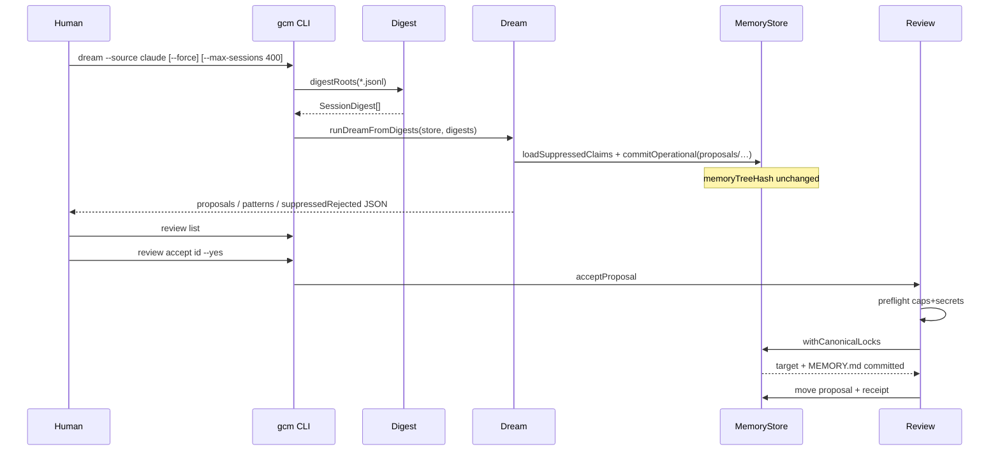

# HITL dreaming — the product loop

**Code:** `src/dream/digest.ts`, `src/dream/run.ts`, `src/review.ts`, `src/corpus/*`  
**Related:** [dream feature](../features/dream.md) · [review feature](../features/review.md) · [HONESTY](../HONESTY.md)

---

## Definition

**Dreaming** in this package means:

> Scan transcripts → reduce to digests → extract candidate memory changes → write
> **proposals** → wait for a human to accept or reject.

It does **not** mean automatic fact reconciliation or silent apply
(omega `memory_dream` parity is explicitly out of scope).

---

## Stages

### Stage A — Corpus digests (CLI)

CLI `dream` walks default harness roots (`defaultCorpusRoots`) and digests every
`*.jsonl` **and** Cursor `*.vscdb` into a `SessionDigest` (`digestRoots`, concurrent
workers). JSONL is streamed line-by-line; `.vscdb` uses the SQLite reader then the
**same** `classifyText` rules. Peak memory stays bounded — never whole multi-GB files.

| Source | Dream path status |
|---|---|
| Claude Code | FULL — `*.jsonl` digests |
| Codex | FULL — `*.jsonl` digests |
| Cursor | FULL for dream — `*.jsonl` **and** `*.vscdb` (BL-DRM-016 closed 2026-08-10) |
| agy / OpenCode | PARTIAL importers; dream still digests `*.jsonl` under default roots |

Details: [corpus-importers.md](../features/corpus-importers.md),
[transcript-formats.md](../adapters/transcript-formats.md).

`truncated` (byte ceiling) is reported separately from `malformed` (parse / unreadable).

### Stage B — Stratified window + empty check

`--max-sessions` (default **400**) selects a **stratified** set: about two-thirds
newest sessions plus evenly sampled older ones (`selectDigests`), ordered by session
clock. Empty digest set → `EMPTY_CORPUS` (nonzero exit).

(Library `runDream` still applies `applyDreamPolicy` on full transcripts for
fixtures; CLI production path is `runDreamFromDigests`.)

### Stage C — Extract proposals (two signals)

1. **Preferences** from digest preference spans (`please remember` / `from now on`).
2. **Prevalence** via `minePrevalence` (≥2 distinct sessions): tool errors, hook
   blocks, user corrections → `memory/pattern-*.md` with `k/n` + citations.

Skip if the target already exists (accepted / human-edited). Suppress if
`claimKey(targetPath, body)` is in `proposals/rejected/` (`loadSuppressedClaims`).

### Stage D — Write proposals (operational)

For each candidate:

1. Secret-scan body + evidence quotes
2. If clean → `commitOperational(proposals/<id>.json)`
3. If secret → increment `withheldSecrets`, skip

Assert `memoryTreeHash` unchanged. Return counts including `suppressedRejected`,
`patterns`, `dropped` (`maxProposals` truncates after evidence-strength sort).

### Stage E — Human review

| Command | Effect on canonical memory |
|---|---|
| `review list` / `show` | none |
| `review reject` | none (`memoryTreeHash` invariant); claim enters suppression set |
| `review accept --yes` | target + index (or delete/expire) |

Accept internals: [review.md](../features/review.md).

---

## Sequence diagram

---

## Idempotency / anti-resurrection

- `proposalId` hashes action/path/`base_hash`/body/evidence quotes (not `createdAt`).
- **Suppression uses `claimKey`**, not `proposalId` — so a reject stays dead even
  when `base_hash` would otherwise change the id after an accept.
- Re-running dream over the same window tends to recreate the same pending ids;
  writing the same operational path again overwrites the JSON.

Next → [architecture/overview.md](../architecture/overview.md)
